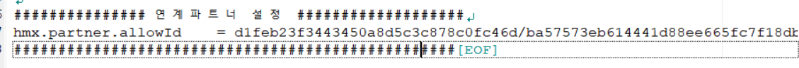
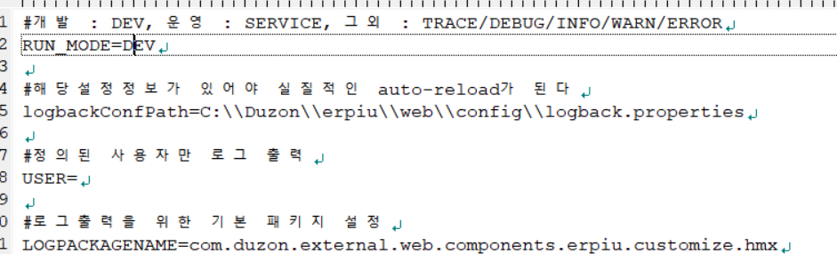
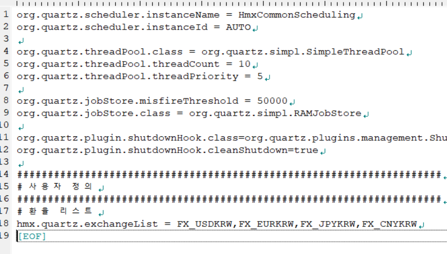

2020-05-20

http://203.242.35.109:85/ERP-U  -> 개발서버
HDUNI ->더존이 부여한 서버키

- 태극기- 개발서버, ERP - 운영서버, 굿서버?-옛날서버
- 회사코드 1000 그룹코드 1000
  로그인 아이디 uni 비번 1234

## ERP 시스템


### 조직정보

- 회사정보등록 : 회사코드 1000, 대표자 정보 변경, 직인 파일 필요할때
- 사업장정보등록:  각 사업장 별로 부가세 신고별로 기준있음
- 갑근세: 각종 ???? 부가세: 부가가치세


2020-05-21 

환경설정

사용자 정보등록

각종 권한 세팅

부서, c/c 정보등록 

인사관리


### 시스템 권한 정보**

- 그룹 정보 등록에서 그룹코드 설정후 우측에서 권한 설정 가능
  - 회사: 선택된 부서만 삭제 및 수정가능하게
  - 사업장: 여러개 사업장중 자기가 속한 사업장만
  - 부서: 자기 부서
  - 사원: 자기 사원

### **그룹 메뉴 관리**

- 그룹 코드 설정 , 업체 사용 메뉴 중 그룹 메뉴가 우리가 어떤거 쓸지 선택함

  - 그룹메뉴에서 위치 변경/삭제는 마우스 우클릭

- 제일 하위 메뉴 선택시 밑에 권한 레벨 설정 가능

  

### **사용자 메뉴 관리** 

- 그룹은 같지만 내용은 좀 다른 사람들이 쓴다
- 사용자별 세부 권한 설정 가능


### **회원 등록 과정**

- 인사관리-사원등록 에서 정보 추가

- 사용자 정보 등록 - 사원 추가, 최초 변경여부 선택

- 권한 관리에서 그룹 권한 부여

- 재로그인

  그룹코드 만들고 사원등록하고 권한 관리 부여받아서 아이디 새로 들어옴

  

  

### **시스템 환경 설정**

: 로그인과 관련된 환경 설정 가능 , 시스템의 기본적인 설정값 변경 가능

- 공통 : 환율
- 회계, 인사: 

인사환경설정

- 환경설정권한등록에서 미리 설정을 해야함- >환경설정 아래에 있는 환경설pr정이 가능함

  

새로운 직급 추가 (사원등록에서)

### **시스템 기준정보 - 코드관리** 

- - 모듈 : 인사
  - 검색: 직위 ,
    - 추가되는 직위 있으면 사용자 사용에서 추가 가능
  - SYS 코드 여부는 지금 사용하고 있는지 여부 나타냄
  - 시스템 사용: 더존에서 고정한 값,
  - 사용자 사용: 수정/삭제/추가 가능
    - 코드는 되도록이면 삭제하지 않는게 좋음 

### **부서정보등록**

- 조회해서 부서 관련 정보( 부서 코드 )

- 만일 조직변경이 될경우 

  - 부서종료일 선택하면 됨

  - 부서종료일 선택 후 부서조회 가능함

    

### **C/C 정보등록**

- 손익센터 Cost Center ( 회계쪽에서 숫자 처리 위해 임의적으로 만들어놓은 부서)

- 추가 가능

  

### **인사관리**

- 퇴직 관리는 사용 안함 ( 설정 후  사용가능)
- 학자금, 동호회, 고과관리 모듈은 HMIS에서 사용
  -  HMIS는 인사 웹인데 따로 회계 기능 추가해놓은 것

인사관리- 사원등록

- 퇴직기준일자 

  - 중도정산을 받은 사람은 중도정산일자=퇴직기준일자

- 사원구분

  - 근태관리 위해서 종류 세팅해놓음
  - 계약직인지 정규직인지 구분 목적

- 근무조

- 직위: 사원, 대리, 차장 등

- 직급: 급수 (4급, 5급)

- 직책: 맡은 책무 (팀장, 부서원)

- 호봉: 1년차면 1호봉 기준 

- 비상연락: 주로 핸드폰 번호  , 기본정보2의 전화번호에 내선번호 입력함

- 기본정보 2

  - 직무: IT관리자, 일반 사용자 등 

  - 사용자정의등록: 

    어느 부문에 있는지, HMIS에서 구분값에 따라 다른 일 지정할 수 있게끔

  - 급여기초: 급여 계산 다르게 할 때 적용하기 위해서

    배우자공제: 급여할때 설정 가능

    국외근로여부: 국외근로수당 설정 가능

    중소기업비과세: 중소기업 해당 감면 대상인지 아닌지

    건강보험, 국민연금: 급여에서 얼마나 차감되는지

    - 과세, 공제 

  - 계정유형: 

    - 판관비(판매관리비): 돈을 안벌어오는 조직, 간접적으로 기여하는 조직 (인사팀)
    - 원가: 돈을 벌어오는 조직(영업팀)

  - 인적사항

    - 현주소: 주민등록 주소와 다를 수 있음

  - 추가정보

    - 인,보증/보험, 출장은 HMIS에서 별도 관리

2020-05-22

## 개발환경 세팅

``` 
\\203.242.35.109 접속
```

**ID: administrator**

**PW:Hyundai_2013**

- 인사: 별도 table
- 회계: 전부 기본 table(더존 제공), 별도 table 조금 있음


이클립스 MARS jdk 1.7

```ㅇ
C:\HMIS\eclipse
```


```dd
\\203.242.35.109\newdev\PROJECT\0.공통\99.개발환경\Duzon\erpiu\web
```


newdev:  현재 새로운 개발 서버, 개발에 관련된 모든 사항들

- PROJECT 폴더 및 공통 아래 개발환경

  : RAM 8기가 SSD 256  +) 외장하드

### config: 시스템 환경설정들 관련, pro

- ACRO EDITOR 오른쪽 마우스 버튼으로 편집
- db-> 이 정보를 긁어다가 db관리하는데 필요한 정보 도와줌

#### hmx.properties: 

처음에 구축했을 때 겨재관련 프로그램이 없어서 그룹웨어 전자결재 관련된 업무와 연결해놓음 따라서 그거와 관련된 설정값들

출장관련해서만 쓰고 쓰지 않는다

pdm: 업체 관련된 첨부파일들 보내주고 삭제하고 다운로드 받을 수 있는 것 관리

 니 업체 코드는 앞에거! (슬래쉬 앞) UUID(총 32글자)

뒤에거는 업체의 PASSWORD개념, 비밀키  (보내온 문서를 이걸로 암호화하기 때문에 보안중요!!)



-> 이걸 건들필요도 없고 만지면 안됨

- hmxpdf.properties: 이제 안씀 , 혹시 몰라서 안 지우고 있음

#### logback.properites: 

was에 관련된 모든 log들이 logs에 들어가는데 

logforj? 로그에 대한 정보들 관리함

- service라고 되어있으면 log가 찍히지 않음  근데!! error는 영향을 안 받음

   

  5번째 줄읽을 파일에 대한걸 저장해놓은 것

- 로그파일이 알아서 압축을 해서 별도로 관리함, 30일이 지나면 지움

- 

- quartz: schedule돌리는거

  -  hmx붙어있는건 다 만든거 
  - 서비스 이름
  - 

#### quartz: 배치 관련 프로그램

- - 이 이름으로 된 프로그램이 was 메모리 상에 올라감 , 이 서비스를 찾아서 프로그램을 실행시킴

  

  - 4~11줄 구글에서
  - 환율리스트: 4개 관련 키워드, 환율은 외환은행->네이버에서 받아옴

#### erpweb.properties: 더존이 세팅해줘서 유지중임

- SSO(Single Sign On): 한번 그룹웨어 접속하면 시스템에 들어가서 로그인안하고 쓸 수 있음

- #5: 급여와 연관되어있음

  ErpServerLocationUrl=http://203.242.32.114:85/ERP-U/

  #8,9 :  hmis 개인정보-> 개인정보조회 

  CodehelpFilePath=/WEB-INF/config/codehelp/codehelp.xml
  MymenuPagesFilePath=/WEB-INF/config/mymenuPages/myMenu.xml

  -> 게시판-> 공지사항 (자바의 controller로 가져오지 않아, 따라서 메뉴프로그램에도 없음)

  -> 별도로 메뉴관리를 안 하고 여기서 관리함!

  #11: erpSubModule=**W**HR|WFI|WTX|WSA|WSY|WRM|WSM|

  W는 Web을 뜻함, hr, fi, tx, sy 는 hmis 에서 확인가능함

  왼쪽 바의 순서는 자유롭게 드래그해서 바꿀 수 있음

  #13: lang=ko  언어가 한글

  #14: template 밑에 scriptBaseRoot 에서 자바 스크립트 사용하기 위한 베이스 루트

  #17: contextroot=/  이게 우리 루트다!

   naver.com**/ **

  #25: headerTitleText =[\uAC1C\uBC1C]\uD604\uB300\uBB34\uBCA1\uC2A4

  한글이 유니코드로 변환돼서 깨지지 않은 상태로 보여줄 수 있다

  #26~#31 맨 처음 로그인 이미지 관련한거

  #33~34 실제로는 real 그 전에 temp

  #35: uploadSplitText=#@DZ@#

  upload폴더의 real에서 볼 수 있는데

  앞에 키 (구분자) 실제 파일명

  #37~39 

  useConnectInfo=true
  useNotice=true
  useComunity=false

  true 값인건만 보임, 개인정보 관리 같은

  #42~52 첨부파일에 대한 기본 값

  - 파일사이즈 단위는 kb
  - 파일명은 35자까지만 나오고 말줄임

  #54~62 무시

  #65~#70 메일을 보낼 수 있는 smtp 서버 주소

  

  

  - root폴더 밑에 

  

  - SSL: TCP, ICP 패킷 보낼 때 암호화시켜서 내용을 못 봐

    

### logs: was올라갈 때 log들이 저장되는 경로

- 위에 2개는 c드라이브


### upload: 

- real과 temp: 첨부파일 올리기 전에 temp(저장 직전)에 있다가 저장 누르면 real(저장 이후)로 넘어가고 temp에는 사라짐
- file은 모두 우리가 알아보지 못하는 code값으로 넘어감
- d드라이브에 있어


### HMIS 폴더(was jdk eclipse root폴더)

- tomcat (WAS는 이클립스 안팎에서 사용 가능함, tomcat 8버전으로 개발해도 상관없음)

  이클립스 안에다 넣고 개발

- jdk 1.7.0 (자바 개발 도구): 자바는 오픈소스, jdk안에는 자바 관련된 모든 기능들이 있음

- eclipse.ini에 환경설정이 잡혀있음;  이미 가상머신이 있기 때문에 복사만 해도 실행됨

- eclipse: 다운받은 것과 별개의 것으로 작동이 됨 

- SVN (서버에 다같이 소스 동기화: 형상관리)

  설정 아이디: svnljh 비번: Dadfb193&#gcv

  - eclipse windows-others-svn-repositories 들어가서 밑에 콘솔창에 마우스우클릭 new->  svn 주소 맨 위에 있는거 url 입력-> always trust선택

    

    deploy 제외 자바 파일만 있음 

    project explorer에서 deploy제외 우 클릭 properties>java build path> libraries> add library

    

    하나의 library 만들어서 다 참조했기 때문에 한번만 설정하면 나머지 것들 다 됨

    

    커서 갖다대면 CTRL-M 

    UTF-8

    

    http://localhost:7979/ 접속 

    

    톰캣에서 띠우는게 아니라 다르게 띄울려면 별도로 띄어줘야함

    이클립스는 모듈을 참고해서  tomcat 밑 config 밑 파이ㄹ들이

    workspace servers 아래에 있는 것들이 들ㅇ온거

    

    

    //개발 환경 세팅

## 5/26 교육

#### web.xml

``` dd
사용자 -> servlet -> filter -> Dispatcher Servlet -> Interceptor -> AoP -> Controller
```


<load-on> 

<filter-mapping>: 

##### **servlet**

- request: 
- response

** filter , interceptor, AOP -> 공통기능 ; 권한 체크 ; 공통부분을 뭘 처리할 수 있음 

##### **filter**

- encoding 설정(한글관련)
- 인터페이스는 공통

##### **DispatcherServlet**

: 배치해주는 servlet 

- 모든 역할을 지시해줌

##### **interceptor** (인사평가, 동의서 관리에 쓰임)

: 로그인, 권한, 설정값 등을 체크 , 로그를 남기고 있음

- <u>controller 들어가기 전에</u>
- dataManager??
- preHandle postHandle afterHandle

##### **AOP(Aspect Orient Programming)**(사용안함)

:  오류 처리 , 트랜잭션 처리

- @ before : <u>controller의 메소드가 수행되기 전에</u>
- @after

##### **Controller**:

: 업무를 수행하는데 정리된 메소드

- 각 기능별로 만들기도 함 , 우리는 **2개**다

    - 화면에 들어가서 기능은 더존! 

    - 화면에 들어가는 것은 우리거  HmxEncryptController

      - 인사관리의 메뉴명을 암호화해놓음

      - views>templates>frame>template.jsp 

      - '~/Hmx/information/environment' 우리가 만들어 놓은 것

      - ```jsp
         var erpiu = window.erpiu || {};
          erpiu.main = new erpiu.Main({
            envUrl: '~/Hmx/information/environment'
          }); //중요
          
        ```

      - serviceName, actionName

- 자바 서비스를 호출해서 만든다! 

- RequestMapping: 던진 요청을 받아서 처리?

- RequestModel : 

- CSRF 공격

- JSP 와 서비스명이 같음 즉, 자바 파일과 같음 

  - 서비스 명으로 가져올 수도 있고 내가 정의한 이름으로도 가져올 수 있음


#### sqlMapConfig.xml

testMapper.xml 세션을 유지해주는 쿼리


#### servlet-context.xml

##### tiles:  표준 레이아웃 구성해주는 거

##### viewresolver:  어떤 jsp를 찾아! 하고 화면과 데이터 모두를 dispatcher Servlet에게 줌


#### service-context.xml

CONFIG파일에 대한 것 읽어들이고 DB에 관한게 있음

하나를 만들어놓고 다른 컴퓨터와 공유 // 최대 8개

```xml
<beans:property name="maxIdle" value="${db.jdbc.maxConnection:8}"/>
```

#### tiles

```ㅇ라
ctrl+shift+R : tiles-definitions
```

스프링에서 제공하는 전체 관리 화면 모두 tiles에서 관리함

template의 jsp 파일에 있는 모든 공통의 기능으로 include해서 


## 진행 과정

**사용자가 http://주소 치고 web server에 접속(아파치 웹 서버)->WAS(톰캣)->HMX Controller(Spring)**

**우리는 이클립스에서 바로 WAS (톰캣; 아파치 역할도 해줌)**

- was가 젤 먼저 부팅되면 web.xml 를 찾아서 제일 첫번째로 간다!

- - servlet-mapping: 웹 페이지는 무조건 컨트롤러를 타고 가는데

    예외적으로 빼놓은 css html 

  - root-context.xml 인 경우 db connection도 가능함 // alias 별칭

  - servlet: get 과 post가 왔다갔다 함

  - spring 관련된 환경설정 정보들을 servlet-context.xml 

       -  interceptor : was와 hmx controller 사이에 뺏어갈려고 씀 // 주로 로그인 체크

       - was와 인터셉터 사이에 filter : chain이라는 개념 
  
 - 기능은 filter와 interceptor 비슷함.

 - url 주소에 맞는 렌더링

 - tiles-definition.xml: spring에서 제공해줌, 어느 페이지에 있는 거든 참조해줌

   tiles: 레이아웃 구성해주는거

    jsp에서 top, left, right, bottom 유연하게 처리해주는거; template으로 정의해두면 다 참조가능해지게

   page와 file이 있는데 page에 page를 넣을 수 있음;

   file은 class로 구성이 되고 

   

    

- viewresolover: 별칭을 .html 과 같은 파일 이름으로 바꿔주는 거
  
- logback
  
- http-method
  
- session-timeout : 분 단위/ 로그아웃

- mvc 패턴 ! 및 web.xml관련 디테일 설명 
  
- jstl 로 if문 가능함 // template.jsp
  
- template.jsp에서 c:set 변수를 선언하고 값을 설정하면 이 값을 참조해서 쓸 수 있음
        
  - 이 기능 추가하면 다른 페이지에서도 다 참조됨!, if문 등 html안에서 개발가능함
        

    ​    

    ​    

*추가로 배울 것
        
spring mvc
        
**html5와 똑같은 기능을 하는 태그 ?*? selector 역할을 해주는게 있어**
        
jquery selector - 특정 id나 클래스가 있으면 태그에 빠르게 접근할 수 있는것, js도 접근할 수 있음

tiles         

​        

 web.xml까지 설명함!

​        

​        


​      

  


회계기준일: 12/31 기준으로 년차가 생성됨 (15개)

한 달 만근-> 1개씩 생김 

복지포인트: 3개월 수습기간 후 지금

과세구간: 부양가족에 따라 소득세가 부여됨


- 근태기준서, 급여기간 	

  - 마감기한: 월말, 월초

  

  **인사기록정보는 직접 건들지 않는다!!**

  - 정보는 절대 발설하지 않는다

  

  

  

  ​				

  

  

  ​		

   


