## JSP

### 1. 웹 프로그래밍


- 웹프로그램의 동작


- 어떠한 로직이 수행되는 WAS에 접근함 (웹 어플리케이션 서버)

### 2.  JSP 문서 작성하기

-  동적 웹어플리케이션 컴포넌트
-  mvc패턴에서 view로 이용됨
- Client가 요청하면 **Controller**가 무엇을 작업할지 판단 -> **model**에게 넘기고 다시 받아서 **view**로 사용자들에게 response함

#### 1) 아키텍쳐


### 3. Servlet 문서 작성하기

#### 1) Servlet

- 동적 웹어플리케이션 컴포넌트 , .java 확장자
- 클라이언트의 request에 동적으로 작동하고, 응답은 html 이용

- java thread 이용하여 동작!
- MVC패턴에서 Controller로 이용됨

#### 2) 닉네임 매핑 방법

1. ##### annotation

```java
@WebServlet("/HWorld") //annotation으로 닉네임 매핑
```

**기존 경로** **: http://localhost:8181/helloworld/servlet/com.javalec.ex.HelloWorld**

URL맵핑 **경로** **: http://localhost:8181/helloworld/HWorld**

2. ##### web.xml파일에서

- <servlet-name>

   : 임의의 이름을 만들어 줍니다.

  **<****servlet-class>**

   : 매핑할 클래스 파일명을 패키지명을 포함하여 정확하게 입력 합니다.

  **<****url-pattern>**

   : servlet-class의 클래스를 매핑할 임의의 이름을 입력 합니다. 주위할 점은 ‘/’로 시작해야 합니다.

```java
<servlet>
  	<servlet-name>helloworld</servlet-name> //servlet 이름 정하기
  	<servlet-class>com.javalex.ex.HelloWorld</servlet-class>//매핑할 클래스 파일명
  </servlet>
  <servlet-mapping>
  	<servlet-name>helloworld</servlet-name>
  	<url-pattern>/hw</url-pattern>
  </servlet-mapping>
```

***project import할 때*** 

***Project > Properties> Javascript> Project Facets> Java 버전 1.7***

***Project > Properties>Java Compiler> 1.7***

#### 3) 프로젝트 만들기

- Servlet클래스는 HttpServlet 클래스를 상속 받음.
- 요청을 하는 객체: 로그인 페이지에서 아이디, 패스워드는 request 객체에 실려 WAS로 감 
- 응답을 하는 객체: DB에서 보고 response객체에 실어서 회원인지 아닌지 보냄

### 4. Client가 GET, POST 방식으로 요청을 할 경우 호출되는 2가지

```java
	protected void doGet(HttpServletRequest request, HttpServletResponse response) throws ServletException, IOException {
		System.out.println("HelloWorld~~");//콘솔출력
        response.setContentType("text/html; charset=euc-kr");
        //응답을 할 때 html파일로 한다
        //한국어로
        PrintWriter writer = response.getWriter();
		
		writer.println("<html>");
		writer.println("<head>");
		writer.println("</head>");
		writer.println("<body>");
		writer.println("<h1>HelloWorld~~~</h1>");
		writer.println("</body>");
		writer.println("</html>");
		
		writer.close();
		
```

#### 1) Client에서 WAS로 request할 때 GET방식

- html내 form태그의 method속성이 get일 경우 호출 됩니다.
-  **웹브라우저의 주소창을 이용하여**   servlet을 요청한 경우에도 호출 됩니다.

```java
protected void doGet(HttpServletRequest request, HttpServletResponse response) throws ServletException, IOException {
		
	} //GET 방식은 URL값에다 정보를 실어 보내니까 보안에 약함
```

#### 2) Client에서 WAS로 request할 때 POST방식

- html내 form태그의 method속성이 post일 경우 호출 됩니다.

```java
protected void doPost(HttpServletRequest request, HttpServletResponse response) throws ServletException, IOException {
		// TODO Auto-generated method stub
	}//header이용해 정보가 전송되어 보안에 강함
```

```html
<!DOCTYPE html>
<html>
<head>
<meta charset="EUC-KR">
<title>Insert title here</title>
</head>
<body>

	<form action="PostMethod" method="post">
		<input type="submit" value="post">
	</form>

</body>
</html>
```


#### 3) Context Path

- 자동으로 server.xml에 추가되는 웹어플리케이션을 구분하기 위한 path

### 5. Servlet 시작

#### 1) Servlet 작동순서


#### 2) Servlet 라이프 사이클

- Servlet은 최초 요청 시 객체가 만들어져 메모리에 로딩되고, 이후 요청 시에는 기존의 객체를 <u>재활용</u>하게 됩니다. 따라서 동작 속도가 빠릅니다.


#### 3) Servlet 선처리, 후처리

 

### 6. Servlet과 HTML

#### 1) HTML form 태그

속성(type, name, value)

 \- type : 태그 종류 지정(ex. text, password, submit, checkbox, radio, reset)

 \- name : input태그 이름

 \- value : name에 해당하는 값(ex. name = value)

- type: checkbox

```html
<input type="checkbox" name="hobby" value="read">독서
<input type="checkbox" name="hobby" value="cook">요리
<input type="checkbox" name="hobby" value="run">조깅
<input type="checkbox" name="hobby" value="swim">수영
<input type="checkbox" name="hobby" value="sleep">취침

```

- select

```html
<select name="protocol">
<option value="http">http</option>
<option value="ftp" selected="selected">ftp</option>
      <option value="smtp">smtp</option>
      <option value="pop">pop</option>
</select>
```


#### 2) Servlet Parameter

- submit 버튼을 누르면 HttpServletRequest객체를 이용하여, Parameter값을 얻음.

  <관련 메소드>

  getParameter(name)

  getParameterValues(name) // 값이 여러개일때 반환해줌

  getParameterNames()//이름들을 다 구함

```java
protected void doPost(HttpServletRequest request, HttpServletResponse response) throws ServletException, IOException {
		// TODO Auto-generated method stub
		System.out.println("doPost");
		
		String id = request.getParameter("id");
		String pw = request.getParameter("pw");
		
		String[] hobbys = request.getParameterValues("hobby");//값이 여러개
		String major = request.getParameter("major");
		String protocol = request.getParameter("protocol");
		
		response.setContentType("text/html; charset=EUC-KR");
		PrintWriter writer = response.getWriter();
		
		writer.println("<html><head></head><body>");
		writer.println("아이디 : " + id + "<br />");
		writer.println("비밀번호 : " + pw + "<br />" );
		writer.println("취미 : " + Arrays.toString(hobbys) + "<br />");
		writer.println("전공 : " + major + "<br />");
		writer.println("프로토콜 : " + protocol);
		writer.println("</body></html>");
		
    	writer.close():
	}
```


### 7. Servlet 초기화

#### 1) 서블릿 초기화 파라미터

특정 Servlet이 생성될 때 초기에 필요한 데이터들이 있습니다. 예를 들어 특정 경로 및 아이디 정보 등 입니다.

이러한 데이터들을 초기화 파라미터라고 하며, 

- web.xml에 기술하고 

```xml
<servlet>
  	<servlet-name>ServletInitParam</servlet-name>
  	<servlet-class>com.javalec.ex.ServletInitParam</servlet-class>
  	
  	<init-param>
  		<param-name>id</param-name>
  		<param-value>abcdef</param-value>
  	</init-param>
  	<init-param>
  		<param-name>pw</param-name>
  		<param-value>1234</param-value>
  	</init-param>
  	<init-param>
  		<param-name>path</param-name>
  		<param-value>C:\\javalec\\workspace</param-value>
  	</init-param>
  	
  </servlet>
  <servlet-mapping>
  	<servlet-name>ServletInitParam</servlet-name>
	<url-pattern>/InitParam</url-pattern>
  </servlet-mapping>
```

```java
protected void doGet(HttpServletRequest request, HttpServletResponse response) throws ServletException, IOException {
		// TODO Auto-generated method stub
		System.out.println("doGet");
		
		String id = getInitParameter("id");
		String pw = getInitParameter("pw");
		String path = getInitParameter("path");
		
		response.setContentType("text/html; charset=EUC-KR");
		PrintWriter writer = response.getWriter();
		writer.println("<html><head></head><body>");
		writer.println("아이디 : " + id + "<br />");
		writer.println("비밀번호 : " + pw + "<br />");
		writer.println("path : " + path);
		writer.println("</body></html>");
		
		writer.close();
	}
```

- Servlet파일에서는 ServletConfig 클래스를 이용해서 접근(사용)합니다.

```java
@WebServlet(urlPatterns={"/ServletInitParam"}, 
            initParams={@WebInitParam(name="id", value="abcdef"),
                        @WebInitParam(name="pw", value="1234"),
                        @WebInitParam(name="path", value="C:\\javalec\\workspace")})
```

#### 2) 데이터 공유

  

```java
String id= getServletContext().getInitParameter("id")
```

#### 3)웹 어플리케이션 감시

바로 ServletContextListener 입니다.

리스너의 해당 메소드가 웹 어플리케이션의 시작과 종료 시 호출 됩니다.(contextInitialized(), contextDestroyed())

- 새로운 클래스 만들음


- 리스너 클래스에 기술

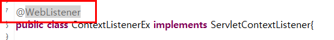

### 8. JSP 본격적으로 살펴보기-1

#### 1) JSP 태그


- JSP는 html파일안에 자바 코드가 있는 것=**

#### 2) JSP 동작원리


- 브라우저에서 검사해보면 JSP파일 코드는 안 뜬다


- Client가 Servlet 요청한 경우 스레드 생성하여 과부하 줄인다


- JSP요청한 경우 처음에 servlet파일 만들어서 메모리에 올리고 다음에 요청오면 메모리에 있는 것 쓴다


### 9. JSP 본격적으로 살펴보기-2

#### 1) 스크립트립, 선언, 표현식

- 스크립트릿(scriptlet) : <% java 코드 기술  %>


- 선언(declaration) : <%! java 코드 기술  %>
  - 전역의 의미로 사용된다


- 표현식(expression) : <%= java 코드 기술  %>

  - 결과값은 String 타입이며, ‘;’를 사용 할 수 없습니다.

  

#### 2)지시자


- page 지시자

```java
<%@page import="java.util.Arrays"%>
<%@ page language="java" contentType="text/html; charset=EUC-KR"
    pageEncoding="EUC-KR"%>   
```

- include 지시자

  ```java
  <h1> include.jsp 페이지 입니다. </h1><br />
  	<%@ include file="include01.jsp" %>
  	<h1> 다시 include.jsp 페이지 입니다. </h1><br />
  ```

  

**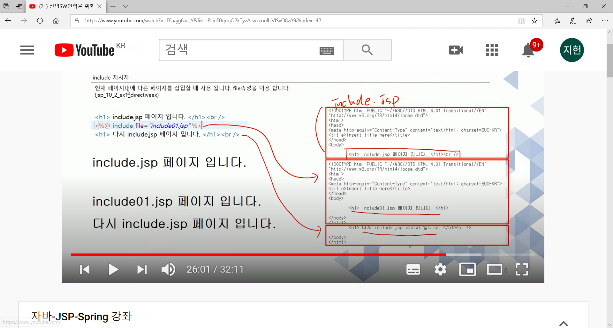**

#### 3) 주석


### 10. JSP 본격적으로 살펴보기-3

#### 1) Request 객체


- URLI는 도메인주소를 제외한 주소


##### 	1. 파라미터 메소드

- getParameter(String name) : name에 해당하는 파라미터 값을 구함.

- getParameterNames() : 모든 파라미터 이름을 구함.

- getParameterValues(String name) : name에 해당하는 파라미터값들을 구함.

  

- form.html에서 실행하고 정보 전송하기 누르면 -> jsp파일로 가서 출력이 됨

#### 2) Response 객체

- sendRedirect() : 지정한 url로 재 이동하는 것 잦음


```html
<!DOCTYPE html>
<html>
<head>
<meta charset="EUC-KR">
<title>Insert title here</title>
</head>
<body>

	<form action="request_send.jsp">
		당신의 나이는 : <input type="text" name="age" size="5">
		<input type="submit" value="전송">
	</form>

</body>
</html>
```

```java
<%!
	int age;
%>

<%
	String str = request.getParameter("age");
	age = Integer.parseInt(str);
	
	if( age >= 20){
		response.sendRedirect("pass.jsp?age=" + age);
	} else {
		response.sendRedirect("ng.jsp?age=" + age);
	}
%>

<%= age %>
```

### 11. 액션태그

JSP페이지 내에서 어떤 동작을 하도록 지시하는 태그입니다. 예를 들어 페이지 이동, 페이지 include 등등 입니다.

#### 1) forward 

- url값은 안 변한다, 실제 내용은 포워딩 된 페이지 값이 보인다

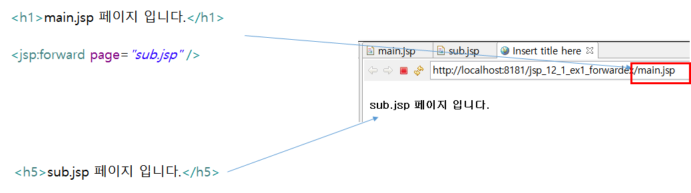

#### 2) include

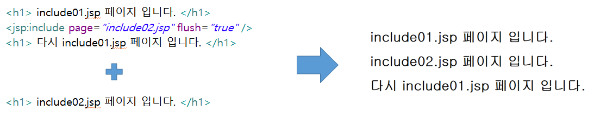

#### 3) Param

forward 및 include 태그에 데이터 전달을 목적으로 사용되는 태그 입니다. 이름과 값으로 이루어져 있습니다.

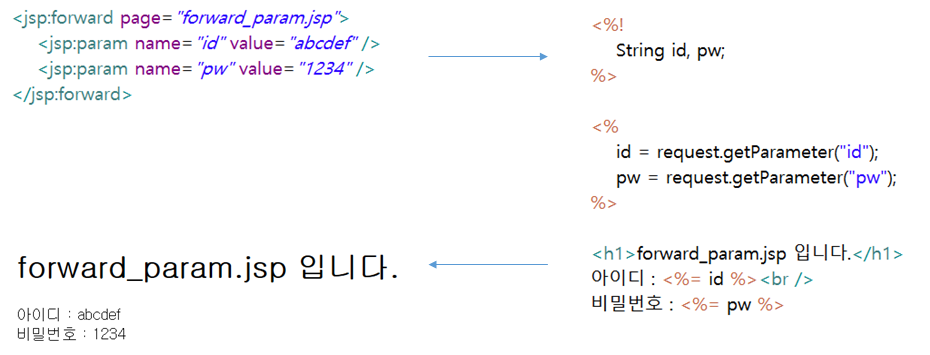

### 12. 쿠키

#### 1)쿠키란?

- 쿠키 객체에다가 id,pw같은 속성같은 것을 저장해놓음
- 쿠키는 서버가 아닌 클라이언트측에 특정 정보를 저장함

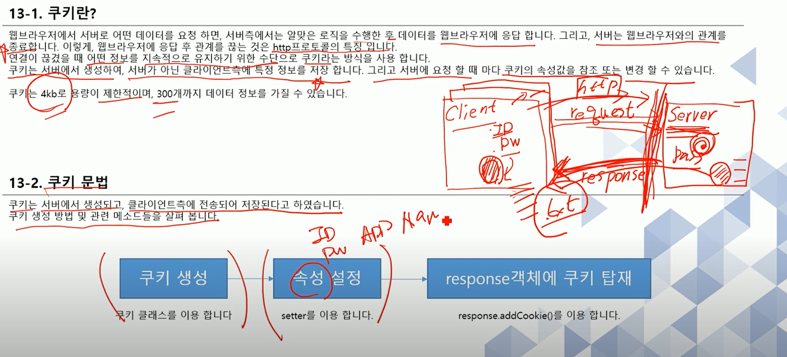

#### 2) 쿠키 문법

- 쿠키 생성, 속성 지정하고 response객체에 탑재시켜야함!

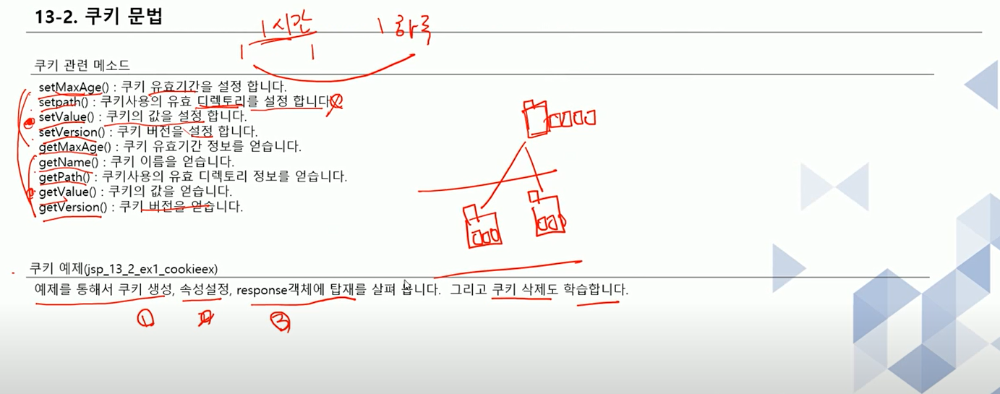

#### 3) 예제

- cookieset.jsp

```java
<body>
	<%
		Cookie cookie = new Cookie("cookieN", "cookieV");//쿠키 이름, 쿠키 value
		cookie.setMaxAge(60*60);	//1시간
		response.addCookie(cookie);
	%>
	
	<a href="cookieget.jsp">cookie get</a>
	
</body>
```

- cookieget.jsp

```java
<body>

	<%
		Cookie[] cookies = request.getCookies();
	
		for(int i=0; i<cookies.length; i++) {
			String str = cookies[i].getName();
			if(str.equals("cookieN")) {
				out.println("cookies[" + i + "] name : " + cookies[i].getName() + "<br />");
				out.println("cookies[" + i + "] value : " + cookies[i].getValue() + "<br />");
				out.println("=====================<br />");
			}
		}
	%>

<a href="cookiedel.jsp">cookie delete</a>

</body>
```


- cookiedel.jsp

```java
<body>

	<%
		Cookie[] cookies = request.getCookies();
		for(int i=0; i<cookies.length; i++) {
			String str = cookies[i].getName();
			if(str.equals("cookieN")) {
				out.println("name : " + cookies[i].getName() + "<br />");
				cookies[i].setMaxAge(0);// 없애버리기
				response.addCookie(cookies[i]);
			}
		}
	%>
	
	<a href="cookietest.jsp">쿠키확인</a>

</body>
```


- cookietest.jsp

```java
<body>

	<%
		Cookie[] cookies = request.getCookies();
		if(cookies != null) {
			for(int i=0; i<cookies.length; i++){
				out.println(cookies[i].getName() + "<br />");
				out.println(cookies[i].getValue() + "<br />");
			}
		}
	%>

</body>
```


- login.html

```html
<body>

	<form action="loginOk.jsp" method="post">
		아이디 : <input type="text" name="id" size="10"><br />
		비밀번호 : <input type="password" name="pw" size="10"><br />
		<input type="submit" value="로그인">
	</form>
	
</body>
```


- loginOk.jsp

```java
<body>
	<%!
		String id, pw;
	%>
	<%
		id = request.getParameter("id");
		pw = request.getParameter("pw");
		
		if(id.equals("abcde") && pw.equals("12345")) {
			Cookie cookie = new Cookie("id", id);//id라는 이름에 abcde 밸류값이 들어감 
			cookie.setMaxAge(60);//1분 유지
			response.addCookie(cookie);//쿠키 탑재
			response.sendRedirect("welcome.jsp");//forwarding
		} else {
			response.sendRedirect("login.html");
		}
	%>

</body>
```


- welcome.jsp

```java
<body>

	<%
		Cookie[] cookies = request.getCookies();
	
		for(int i=0; i<cookies.length; i++) {
			String id = cookies[i].getValue();
			if(id.equals("abcde")) out.println(id + "님 안녕하세요." + "<br />");
		}
	%>
	
	<a href="logout.jsp">로그아웃</a>
	
</body>
```

- logout.jsp

```java
<body>
	
	<%
		Cookie[] cookies = request.getCookies();
		
		if(cookies != null) {
			for(int i=0; i<cookies.length; i++) {
				if(cookies[i].getValue().equals("abcde")){
					cookies[i].setMaxAge(0);
					response.addCookie(cookies[i]);
				}
			}
		}
		
		//response.sendRedirect("login.html");
		response.sendRedirect("cookietest.jsp");
	%>
	
</body>
```

### 13. 세션

#### 1) 세션?

쿠키와 달리 클라이언트의 특정 위치에 저장되는 것이 아니라, 서버상에 객체로 존재 합니다.

따라서 세션은 서버에서만 접근이 가능하여 보안이 좋고, 저장할 수 있는 데이터에 한계가 없습니다.

#### 2) 세션 문법

- 클라이언트 요청 발생하면 자동생성됨

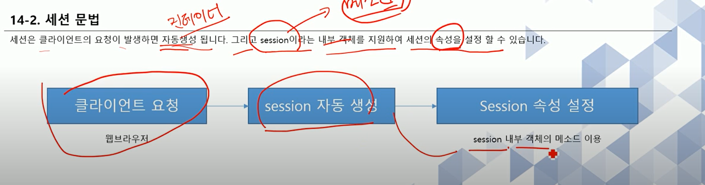

- setAttribute()

```java
<%
		session.setAttribute("mySessionName", "mySessionData");
		session.setAttribute("myNum", 12345);
	%>
	
	<a href="sessionget.jsp">session get</a>
```

- getAttribute()

```java
<%
		Object obj1 = session.getAttribute("mySessionName");//object 형태로 속성 가져옴
		String mySessionName = (String)obj1;//String으로 변환
		out.println(mySessionName +"<br />");
		
		Object obj2 = session.getAttribute("myNum");
		Integer myNum = (Integer)obj2;
		out.println(myNum +"<br />");
```

- .getAttributeNames();//모든 네임 다 get

```java
		String sName;
		String sValue;
		Enumeration enumeration = session.getAttributeNames();//모든 네임 다 get
		while(enumeration.hasMoreElements()){
			sName = enumeration.nextElement().toString();
			sValue = session.getAttribute(sName).toString();
			out.println("sName : " + sName + "<br />");
			out.println("sValue : " + sValue + "<br />");
		}
```

- getId();

```java
		String sessionID = session.getId();
		out.println("sessionID : " + sessionID + "<br />");
```

- getMaxInactiveInterval();//유효시간

```java
		int sessionInter =  session.getMaxInactiveInterval();//유효시간
		out.println("sessionInter : " + sessionInter + "<br />");
```

- removeAttribute("mySessionName");

```java
session.removeAttribute("mySessionName");
		Enumeration enumeration1 = session.getAttributeNames();
		while(enumeration1.hasMoreElements()){
			sName = enumeration1.nextElement().toString();
			sValue = session.getAttribute(sName).toString();
			out.println("sName : " + sName + "<br />");
			out.println("sValue : " + sValue + "<br />");
		}
		
```

- session.invalidate();

```java
session.invalidate();//세션에 있는 모든 데이터 삭제
		if(request.isRequestedSessionIdValid()) {
			out.println("session valid");
		} else {
			out.println("session invalid");
		}
	%>

```

#### 3) 로그인 과정 예제

```html
<!DOCTYPE html>
<html>
<head>
<meta charset="EUC-KR">
<title>Insert title here</title>
</head>
<body>

	<form action="loginOk.jsp" method="post">
	
		아이디 : <input type="text" name="id" size="10"><br />
		비밀번호 : <input type="password" name="pw" size="10"><br />
		<input type="submit" value="로그인">
	</form>
	<form action="" method="">
	
	</form>	
</body>
</html>
```

```java

<body>
	<%!
		String id, pw;
	%>
	<%
		id = request.getParameter("id");
		pw = request.getParameter("pw");
		
		if(id.equals("abcde") && pw.equals("12345")) {
			session.setAttribute("id", id);	
			response.sendRedirect("welcome.jsp");
		} else {
			response.sendRedirect("login.html");
		}
	%>

</body>
```

```java
	<%
		Enumeration enumeration = session.getAttributeNames();
		while(enumeration.hasMoreElements()){
			String sName = enumeration.nextElement().toString();
			String sValue = (String)session.getAttribute(sName);
			
			if(sValue.equals("abcde")) out.println(sValue + "님 안녕하세요." + "<br />");
		}
	%>
	
	<a href="logout.jsp">로그아웃</a>
```

```java
<%
		Enumeration enumeration = session.getAttributeNames();
		while(enumeration.hasMoreElements()) {
			String sName = enumeration.nextElement().toString();
			String sValue = (String)session.getAttribute(sName);
			
			if(sValue.equals("abcde")) session.removeAttribute(sName);
		}
		
	%>
	
	<a href="sessiontest.jsp">sessionTest</a>
```

### 14. 예외 페이지

#### 1) 필요성

: 친근하지 않은 페이지가 뜸

#### 2) 방식


- page 지시자 활용해서 errorPage.jsp로 이동
- isErrorPage default값은 flase, setStatus도 200이 정상


```java
<%@ page language="java" contentType="text/html; charset=EUC-KR"
    pageEncoding="EUC-KR"%>

<% response.setStatus(200); %>
<!DOCTYPE html PUBLIC "-//W3C//DTD HTML 4.01 Transitional//EN" "http://www.w3.org/TR/html4/loose.dtd">
<html>
<head>
<meta http-equiv="Content-Type" content="text/html; charset=EUC-KR">
<title>Insert title here</title>
</head>
<body>
	404에러 입니다.
</body>
</html>
```

```java
<%@ page language="java" contentType="text/html; charset=EUC-KR"
    pageEncoding="EUC-KR"%>

<% response.setStatus(200); %>
<!DOCTYPE html PUBLIC "-//W3C//DTD HTML 4.01 Transitional//EN" "http://www.w3.org/TR/html4/loose.dtd">
<html>
<head>
<meta http-equiv="Content-Type" content="text/html; charset=EUC-KR">
<title>Insert title here</title>
</head>
<body>
	500에러 입니다.<br />
</body>
</html>
```

### 15. 자바 빈

#### 1) 빈 이란?

반복적인 작업을 효율적으로 하기 위해 빈을 사용 합니다. 빈이란? JAVA언어의 데이터(속성)와 기능(메소드)으로 이루어진 클래스 입니다.

#### 2) 빈 만들기

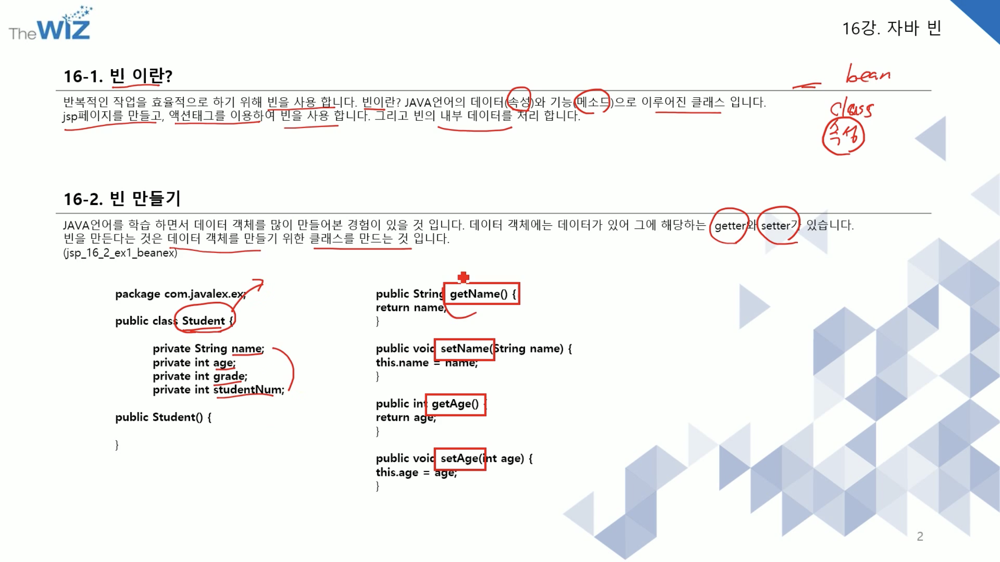

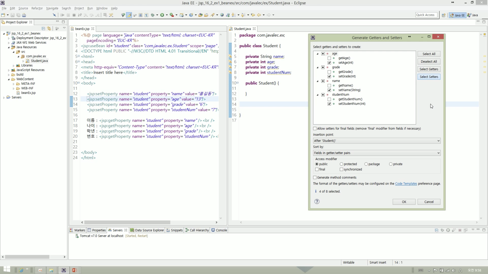

#### 3) 빈 관련 액션 태그 (useBean, setProperty, getProperty)

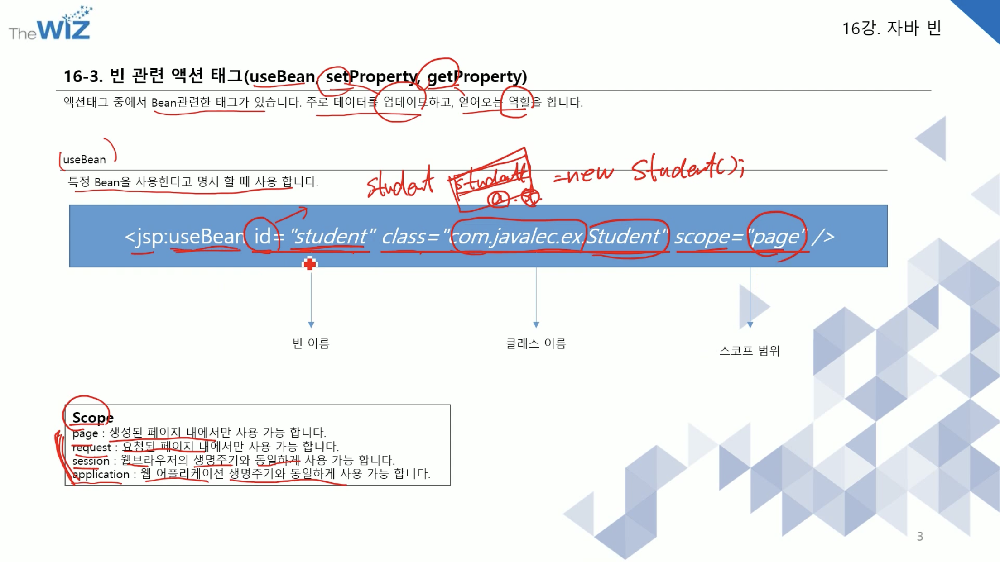

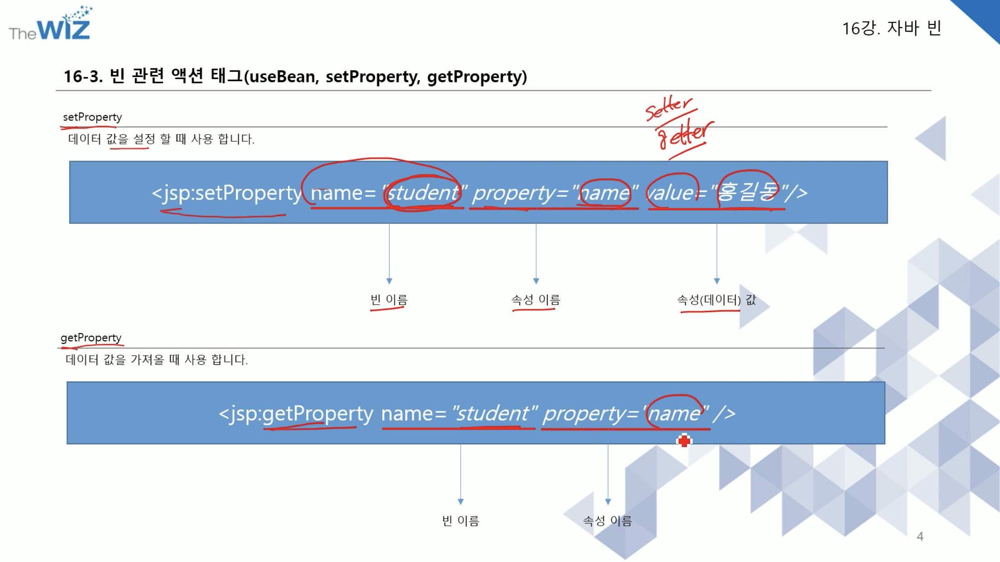

- <jsp:useBean id="student" class="com.javalec.ex.Student" scope="page">

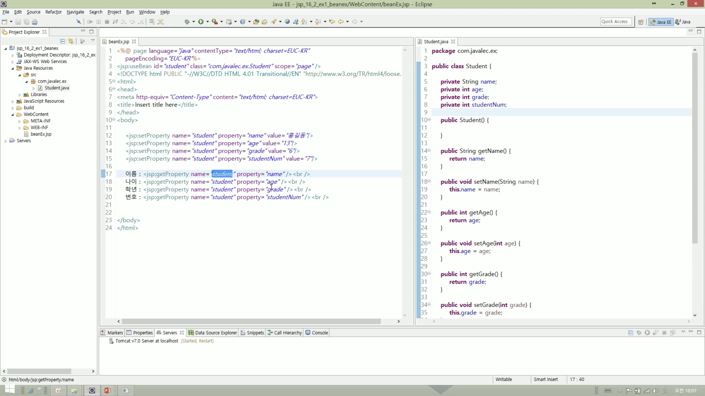


### 20. 커넥션풀

#### 1) ㄴDAO, DTO

- DAO: 데이터베이스에 접근하는 것
- DTO: 자바에서 사용하는 객체, 오브젝트로 바꿔주는 것

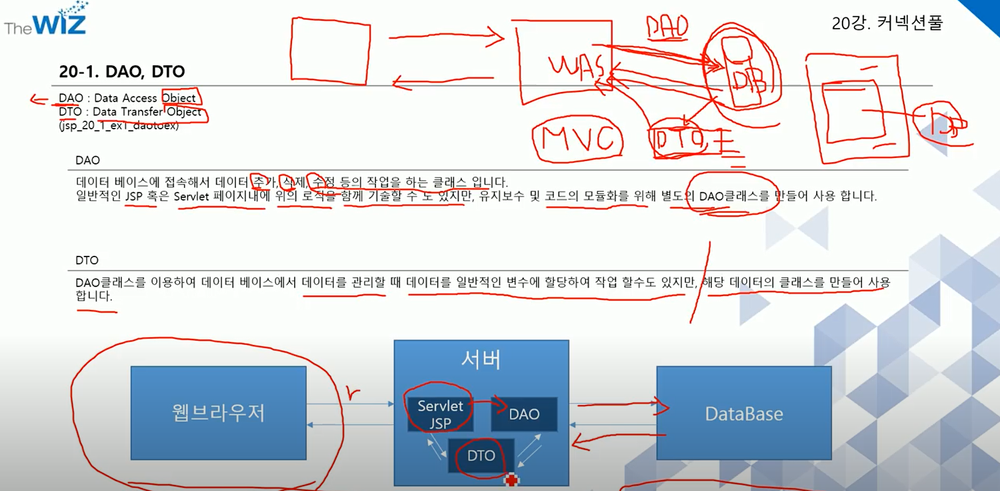

#### 2) **PreparedStatement 객체

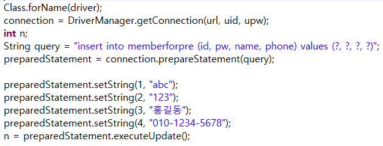

#### 3) 커넥션 풀

- 미리미리 CLASS 객체를 만들어놔서 부하를 줄임

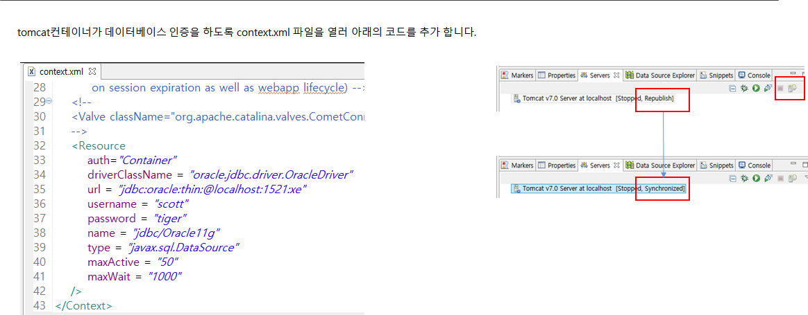