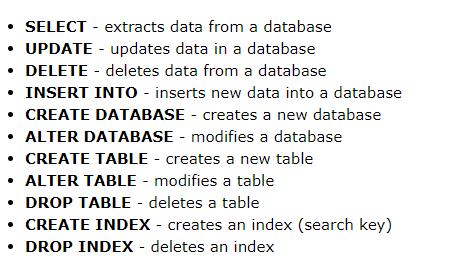
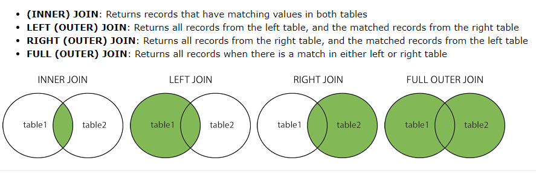

# MSSQL Server

### 1. SQL Syntax



#### (1)select *

```mssql
SELECT * FROM table_name;
```

#### (2)select distinct

```mssql
SELECT DISTINCT Country FROM Customers;
SELECT COUNT(DISTINCT Country) FROM Customers;
--from에 select문 넣을려면 as 써야함
SELECT COUNT(*)  as DisCountryTable
FROM (SELECT DISTINCT Country FROM Customers) as DisCountry
```

#### (3) select AND, OR , NOT

```mssql
SELECT * FROM Customers
WHERE Country='Germany' AND (City='Berlin' OR City='München');

SELECT * FROM Customers
WHERE NOT Country='Germany' AND NOT Country='USA';
```

#### (4) order by

```mssql
--오름차순, 내림차순 
SELECT *
FROM Customers
order by Country DESC 
```

#### (5) SQL Insert into

```mssql
insert into Customers(CustomerID,CompanyName, City, Country)
VALUES ('SM','Samsung','Seoul','ko');
```

#### (6)SQL null values

null 과 빈 문자열은 다름

```mssql
select * from dbo.Employees
where Region is not null --is null
-- where Region != ''
```

#### (7) SQL Update

```mssql
update Customers
set ContactName='Juan'
where Country='Mexico'
```

#### (8)Delete

```mssql
select * from Customers
where CompanyName= 'Samsung'

begin transaction
delete from Customers
where CompanyName= 'Samsung'

rollback
```

#### (9)Select Top

```mssql
select top 10 * from Customers
select top 50 percent * from Customers
```

#### (10) Min and Max

```mssql
select min(UnitPrice) from dbo.Products
```

#### (11)COUNT AVG SUM

```mssql
select count(ProductID) from dbo.Products

select avg(UnitPrice) from dbo.Products

select sum(Quantity) from dbo.[Order Details]
```

#### (12) LIKE

```mssql
select * from Customers
where CompanyName like '__r%'
```

#### (13)Wildcard

```mssql
select * from Customers
where City like '[bsp]%'

select * from Customers
where City like '[d-f]%'

select * from Customers
where City not like '[bsp]%'
```

#### (14)In 

```mssql
select * from Customers
where Country in (select distinct Country from dbo.Suppliers)
```

#### (15) Between

```mssql
select * from dbo.Products
where UnitPrice between 10 and 20
and not CategoryID in (1,2,3)
```

#### (16) alias

```mssql
SELECT o.OrderID, o.OrderDate, c.CompanyName
FROM Customers AS c, Orders AS o
WHERE c.CompanyName='Around the Horn' AND c.CustomerID=o.CustomerID;
```

#### (17)Join



```mssql
--(inner) join
select a.OrderID, b.CompanyName, a.OrderDate  
from Orders a 
join Customers b on a.CustomerID = b. CustomerID

```

#### (18)Inner join (3개 이상)

```mssql
select a.OrderID, b.CompanyName, a.OrderDate  
from Orders a 
inner join Customers b on a.CustomerID = b. CustomerID
join Shippers c on a.ShipVia= c.ShipperID
```

#### (19) Left join

```mssql
select *
from Customers a 
 left join Orders b on a.CustomerID = b. CustomerID
 where b.OrderID is null
```

#### (20) Right join

```mssql
select *
from Customers a 
 right join Orders b on a.CustomerID = b. CustomerID
```

#### (21)full outer join

```mssql
select *
from Customers a 
full outer join Orders b on a.CustomerID = b. CustomerID

```

#### (22)self join

```mssql
SELECT A.CompanyName AS CustomerName1, B.CompanyName AS CustomerName2, A.City
FROM Customers A, Customers B
WHERE A.CustomerID = B.CustomerID
AND A.City = B.City
ORDER BY A.City;

```

#### (23)Union Operator

- union all: 중복까지 다 보여줌

```mssql
select City from Customers
union all
select City from Suppliers
order by Cit
```

```mssql
select 'Customer' as Type, City , Country from Customers
union 
select 'Supplier' , City, Country from Suppliers
order by City
```

#### (24) Group by

```mssql
select b.CompanyName as ShipperName, count(a.OrderID) as OrderCount 
from Orders a
join Shippers b on a.ShipVia = b. ShipperID
group by b.CompanyName
```

#### (25) Having

having 절은 group by 뒤에

```mssql
select Country, count(CustomerID) AS CustomerId
from Customers
group by Country
having count(CustomerId) > 5
order by count(CustomerID) desc


SELECT b.LastName, b.FirstName, COUNT(a.OrderID) AS NumberOfOrders
FROM Orders a
JOIN Employees b ON a.EmployeeID = b.EmployeeID)
GROUP BY b.LastName, b.FirstName
HAVING COUNT(a.OrderID) > 100;
ORDER BY  COUNT(a.OrderID) desc
```

#### (26) Exists

in이랑 비슷한 개념 

//주문한 적이 있는 사용자 이름 출력하는 느낌

```mssql
select SupplierName
from Suppliers a
where exists(select * from Products b where a.SupplierID = b.SupplierID and b.UnitPrice>100)
```

#### (27) Any, all

 where 나 having 절에서 쓰임

```mssql
SELECT ProductName
FROM Products
WHERE ProductID = ANY (SELECT ProductID FROM OrderDetails WHERE Quantity = 10);
```


#### (28) Select Into

테이블을 물리적으로 백업할 때

```mssql
SELECT * INTO CustomersBackup2017
FROM Customers
where Country='Germany'

select a.CustomerID, a.CompanyName 
into CustomersBackup2017_2
from Customers a
join Orders b on a.CustomerID = b.CustomerID
```

테이블 껍데기 만들기

```mssql
SELECT * INTO newtable
FROM oldtable
WHERE 1 = 0;
```

#### (29) Insert into select

select문에 해당하는 데이터를 벌크로 insert할 때 

```mssql
INSERT INTO  newtable (CompanyName, City, Country)
SELECT CompanyName, City, Country FROM Suppliers;

delete newtable
INSERT INTO  newtable (CompanyName, City, Country)
SELECT CompanyName, City, Country FROM Suppliers
where Country='Germany'

```

#### (30)Null functions

isnull() : 연산할 때 isnull 필수

```mssql
select UnitPrice
	, 
	 UnitPrice * (UnitsInStock + ISNULL(UnitsOnOrder, 0)) as SomethingAmount
from Products
```

#### (31)Stored Procedures

```mssql
create proc dbo.usp_get_customer
as
/*
	Created: 20200528
	Created by: Liah
	TEST	
		dbo.usp_get_customer

*/
begin
	SELECT * FROM dbo.Customers
end
```

새로운 세션창을 연다

```mssql
exec dbo.usp_get_customer
```

​	파라미터 하나

```mssql
create proc dbo.select_customers
@City varchar(255)
as
/*
	Created: 20200528
	Created by: Liah
	TEST	
		dbo.usp_get_customer

*/
begin
	SELECT * FROM dbo.Customers
	where City=@City
end
```

세션창 열어서

```mssql
exec dbo.select_customers 'Berlin'
exec dbo.select_customers @City='Berlin'
```

파라미터 여러개

```mssql
alter proc dbo.select_customers
@City varchar(255)
@PoastalCode varchar(255)
as
/*
	Created: 20200528
	Created by: Liah
	TEST	
		dbo.usp_get_customer

*/
begin
	SELECT * FROM dbo.Customers
	where City=@City and PoastalCode=@PoastalCode
end
```

```mssql
exec dbo.select_customers 'Berlin','12209'
```

parameter중 하나만 줬을때도 가능하게 하려면

```mssql
exec dbo.select_customers '','12209'
```

```mssql
begin
	SELECT * FROM dbo.Customers
	where City= case when @City='' then City else @City end
	and PoastalCode=case when @ PoastalCode='' then  PoastalCode else @ PoastalCode end
```

#### (32) Comments

--붙이면 주석됨

```mssql
--select all
/*
	this is block comments
*/
SELECT * FROM Customers -- WHERE City='Berlin';
```

