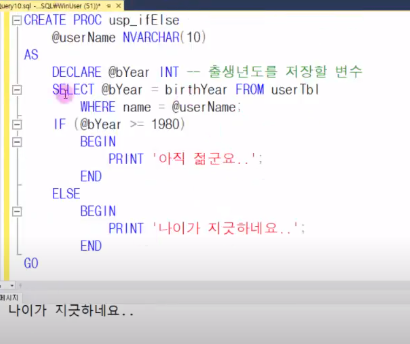
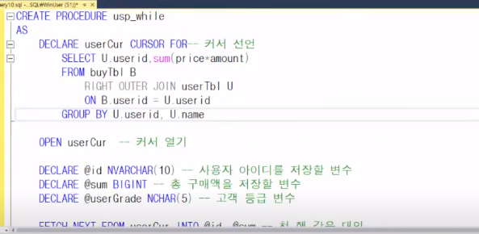
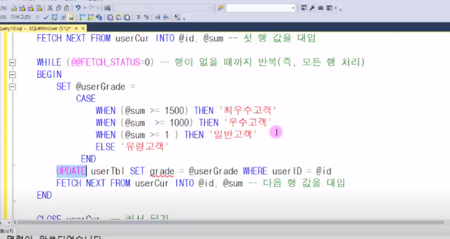
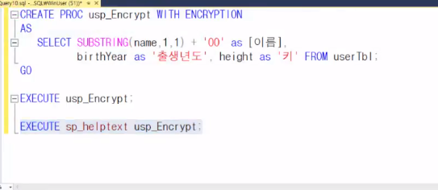
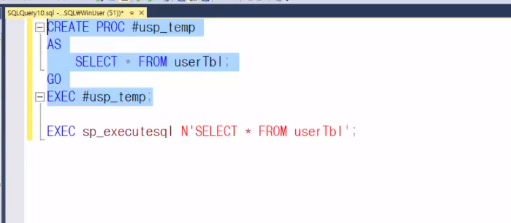
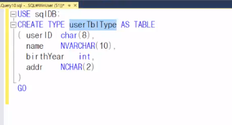
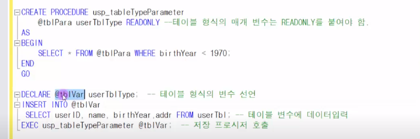
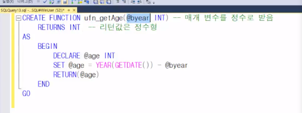
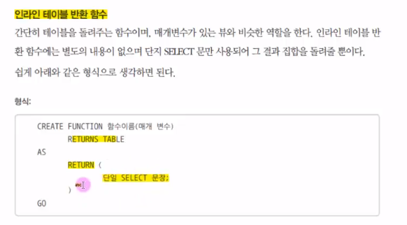
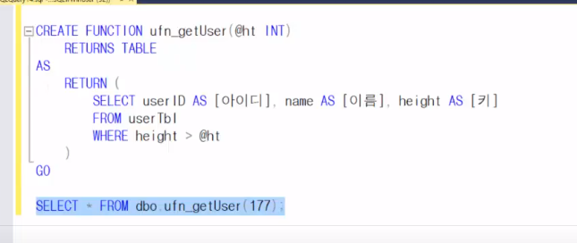

- 프로시저 생성 구문

```mssql
CREATE PROCEDURE 프로시저名
 @SiteCD varchar(10) ,   
 @result int output 
AS 
SET NOCOUNT ON 
Go

Declare
@result int
exec 프로시저名 '변수값' , @result output
print @result
```



  ```mssql
create proc usp_Case
	@username VARCHAR(20)
AS
	DECLARE @year INT
	DECLARE @tti VARCHAR(3)
	SELECT @year= birthYear from user
		where name=@usernam;
	set @tti= 
		case
        	when () then '원숭이'
        	else
        	
        	
		end;
		print @username + '의 띠'+@tti
GO
  ```

- Cursor 한 행 처리





- return 하는 프로시져
  - userid가 있는지 없는지

```mssql
CREATE PROCEDURE 프로시저名
 @username varchar(10)   

AS 
	declare @userID char(8);
	select @userID= userID FROM userTbl
				where name=@username;
	if(@userID <>'')
		RETURN 0;//성공일경우
	ELSE
		RETURN -1;

Go

DECLARE @retval INT;
EXEC @retval=프로시저명 '은지원'
SELECT @retval;
```

- try, catch문

```mssql
CREATE PROCEDURE 프로시저名
 @username varchar(10)   

AS 
	declare @userID char(8);
	BEGIN TRY
		
	END TRY
	
	BEGIN CATCH
	
	END CATCH
Go

EXEC 프로시저명 '은지원','EHE'

```

- 암호화한 프로시저



- 임시 저장 프로시저



- Table 타입





- 프로시저 이름 정할때는 usp_로 시작하는게 좋다
- 프로시저를 실행시에 첫번째만 최적화 및 컴파일을 수행하고,

​       나머지는 메모리(캐시)의 것을 사용하게 된다

- 사용자 정의 함수



```mssql
select dbo.ufn_getAge(1979);

drop function ufn_getAge //함수 제거
```

- 인라인 테이블 반환 함수



